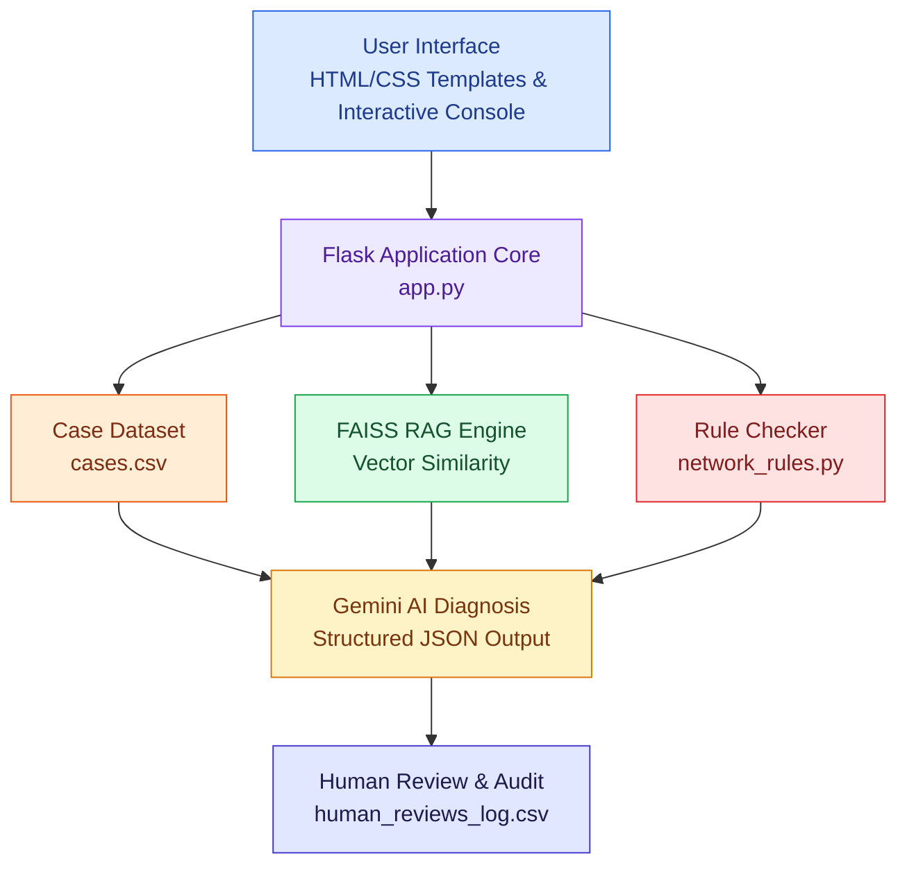

# NetSage AI: AI-Assisted Network Troubleshooting Platform
NetSage AI is an intelligent, AI-assisted network troubleshooting and diagnostic platform engineered specifically for Cisco Packet Tracer and lab networking environments. It bridges the gap between traditional networking education and modern artificial intelligence by combining deterministic rule-checking, vector-based similarity search (RAG), and mandatory human-in-the-loop validation.

## Key Features
- AI-Driven Diagnostics: Integrates the Google Gemini API to analyze raw network symptoms, topology notes, and CLI show-command outputs from Cisco Packet Tracer labs
- Retrieval-Augmented Generation (RAG): Utilizes FAISS (Facebook AI Similarity Search) and Sentence Transformers to embed and retrieve historical case contexts, grounding AI responses in real engineering data.
- Deterministic Python Rule Checker: Programmatically scans raw log files and symptoms via network_rules.py to catch common Layer 1–3 anomalies (such as interface shutdown states, IP mismatches, and trunking errors) independently of the LLM.
- Human-in-the-Loop Review Workflow: Enforces responsible AI usage by requiring engineers to review, audit, and log every AI diagnosis as Accepted, Edited, or Rejected (human_reviews_log.csv).
- Analytics Dashboard: Real-time metrics counters and visual distributions tracking review agreements, issue types (VLAN, DHCP, Static Routing, ACL, etc.), and system performance
- Production-Ready Deployment: Hosted on Render using Gunicorn, backed by an automated keep-alive health check monitor.

## Technology Stack
- Backend: Python, Flask, Jinja2 Templates
- AI & NLP: Google GenAI SDK (gemini-pro/gemini-2.5), Sentence Transformers
- Vector Search: faiss-cpu
- Database & Data Processing: SQLite (netsage.db), Pandas, NumPy
- Frontend: HTML5, CSS3, Responsive Web UI
- Hosting & Automation: Render Cloud Platform, Cron-Job.org (Health-check pinging)

## System Architecture


## NetSage AI Architecture



## Project Structure


## 📁 Project Structure

```text
NetSage-AI/
├── ai/
│   ├── __init__.py
│   ├── gemini_service.py
│   └── schemas.py
├── data/
│   ├── cases.csv
│   ├── diagnosis.csv
│   ├── human_reviews_log.csv
│   └── netsage.db
├── database/
│   ├── __init__.py
│   ├── database.py
│   └── models.py
├── prompts/
│   └── diagnose_prompt.txt
├── retrieval/
│   ├── __init__.py
│   └── case_retrieval.py
├── review/
│   ├── __init__.py
│   └── review_manager.py
├── static/
│   ├── css/
│   │   └── style.css
│   └── js/
│       ├── analytics.js
│       └── main.js
├── templates/
│   ├── analytics.html
│   └── index.html
├── tests/
│   ├── test_api.py
│   ├── test_retrieval.py
│   └── test_rules.py
├── validation/
│   ├── __init__.py
│   └── network_rules.py
├── vectorstore/
│   ├── index.faiss
│   └── metadata.json
├── .env
├── .gitignore
├── README.md
├── app.py
├── config.py
└── requirements.txt
```
